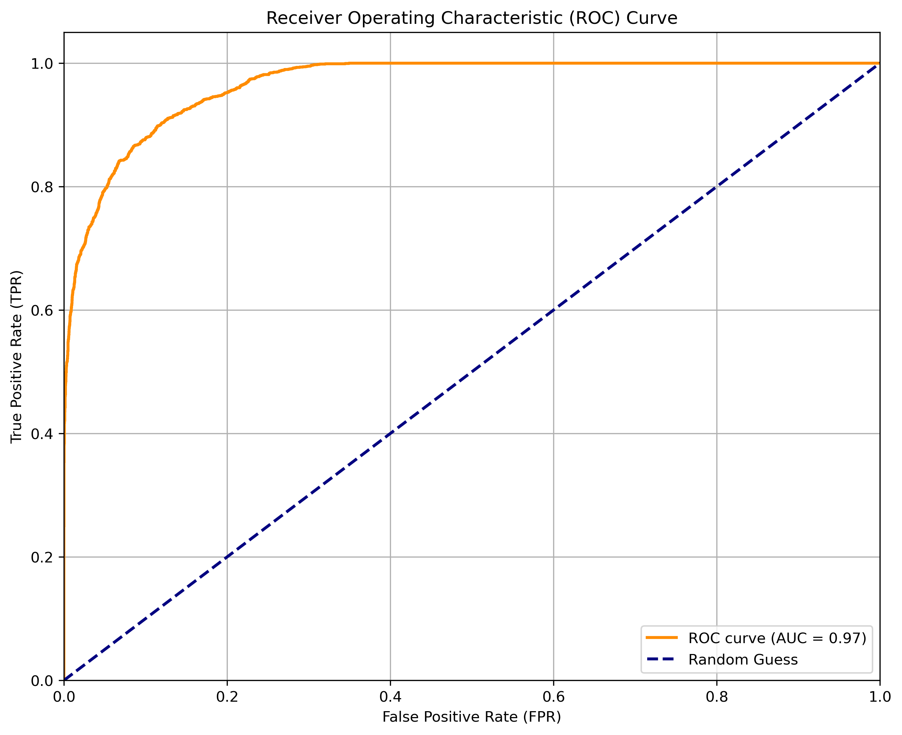
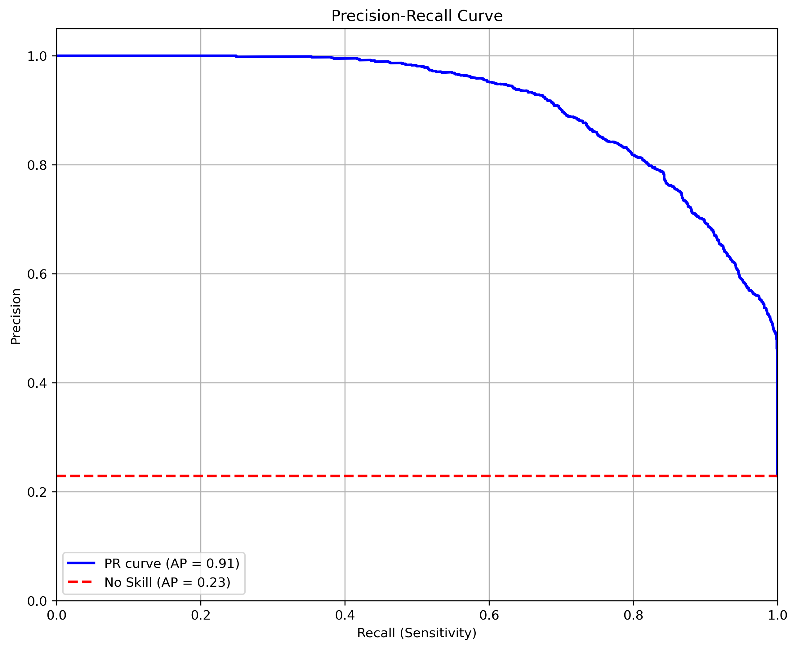

# Loan Approval Classification using Deep Learning

This repository contains the code and resources for a loan approval classification project, developed as part of a graduate project for applied deep learning. The goal is to predict whether a loan application should be approved or denied based on applicant information, using a deep neural network built with TensorFlow/Keras.

## Project Overview

The project involves:
- Loading and exploring a synthetic loan dataset.
- Cleaning and preprocessing the data, including handling outliers and encoding features.
- Engineering new features to potentially improve model performance.
- Building, training, and tuning a feedforward neural network using KerasTuner.
- Incorporating techniques to handle class imbalance (class weighting).
- Evaluating the model using various metrics, including AUC-ROC and Precision-Recall AUC.
- Explaining model predictions using SHAP values.

## Dataset

- **Source:** The dataset is a synthetic version inspired by the original [Credit Risk dataset on Kaggle](https://www.kaggle.com/datasets/laotse/credit-risk-dataset) and enriched with additional variables based on [Financial Risk for Loan Approval data](https://www.kaggle.com/datasets/lorenzozoppelletto/financial-risk-for-loan-approval).
- **Link:** [Loan Approval Classification Data on Kaggle](https://www.kaggle.com/datasets/taweilo/loan-approval-classification-data)
- **Description:** Contains 45,000 records and 14 variables (mix of categorical and continuous). SMOTENC was used in its creation to enlarge instances. The target variable `loan_status` indicates loan approval/denial (or default risk, depending on interpretation - 0/1 encoding used).
- **Usage:** Download the `loan_data.csv` file from the Kaggle link above and place it in the `data/` directory (or the root directory if you prefer, just update the notebook path). *(Note: The CSV is not included in this repository due to potential size constraints).*

## Project Structure

```
Loan-Approval-Classification/
├── data/                     # (Optional) Directory for data files
│   └── loan_data.csv         # Dataset file (not committed if large)
├── images/                   # Directory for generated plots/images
│   ├── download_2.png        # Example ROC curve image
│   ├── download_213.png      # Example PR curve image
├── exploratory_data_analysis/ # Directory for EDA notebooks
│   └── data_analysis.ipynb   # Notebook for exploratory data analysis
├── models/                   # Directory for saved models and training notebooks
│   └── ANN.ipynb             # Notebook for building and training the ANN model
├── README.md                 # Project documentation (this file)
├── .gitignore                # Specifies intentionally untracked files
└── requirements.txt          # List of project dependencies
```

## Methodology

The project follows these key steps:

1.  **Data Loading:** Loading the `loan_data.csv` dataset.
2.  **Exploratory Data Analysis (EDA):** Understanding data distributions, correlations, and identifying potential issues like outliers and class imbalance.
3.  **Data Cleaning:** Handling outliers using IQR clipping.
4.  **Preprocessing:** One-hot encoding categorical features and standardizing numerical features using `StandardScaler`.
5.  **Feature Engineering:** Creating interaction terms (e.g., `loan_amnt_interaction`, `income_credit_interaction`), polynomial features, ratio features (`debt_to_income`), log transformations, and age group bins.
6.  **Data Splitting:** Dividing the data into training (60%), validation (20%), and test (20%) sets using stratified sampling.
7.  **Model Building:** Defining a feedforward neural network architecture with tunable hyperparameters (units per layer, dropout rates, activation function, learning rate) using Keras. `LayerNormalization` and `Dropout` are used for regularization.
8.  **Hyperparameter Tuning:** Using KerasTuner (`Hyperband`) to find the optimal hyperparameters, optimizing for validation recall (`val_recall`) to address class imbalance.
9.  **Model Training:** Training the best model configuration found by the tuner, incorporating `class_weight='balanced'` to handle imbalance and `EarlyStopping` to prevent overfitting.
10. **Model Evaluation:** Assessing performance on the unseen test set using accuracy, precision, recall, F1-score, confusion matrix, AUC-ROC curve, and Precision-Recall (PR) curve.


## Results

- The best-tuned model achieved a test accuracy of approximately **90.02%**.
- Class weighting and tuning for recall significantly improved the recall for the minority class (1) to **0.84**, compared to earlier models, although this came with a decrease in precision (to 0.79, from 0.83).
- The F1-score for the minority class is **0.81**.
- The overall weighted F1-score is **0.91**.
- **AUC-ROC:** 0.96 (Excellent class separation overall)
  
- **Precision-Recall AUC (Average Precision):** 0.91 (Very good performance, especially considering the ~0.23 baseline due to imbalance)
  


## How to Run

Follow these steps to set up and run the project:

1. **Clone the Repository**  
    ```bash
    git clone https://github.com/Hyde06/loan-approval-deep-learning.git
    cd loan-approval-deep-learning
    ```

2. **Set Up Environment (Optional but Recommended)**  
    Create and activate a virtual environment:  
    - On macOS/Linux:  
      ```bash
      python -m venv venv
      source venv/bin/activate
      ```
    - On Windows:  
      ```bash
      python -m venv venv
      venv\Scripts\activate
      ```

3. **Install Dependencies**  
    Install the required Python packages:  
    ```bash
    pip install -r requirements.txt
    ```

4. **Download Data**  
    - Obtain the `loan_data.csv` file from Kaggle.  
    - Place it in the appropriate directory (e.g., `data/` or the root directory).

5. **Run the Notebook**  
    Open and execute the Jupyter Notebook:  
    ```bash
    jupyter notebook ANN.ipynb
    ```
    **Note:** The hyperparameter tuning step (`tuner.search`) may take significant time to complete.

6. **(Optional) Load Saved Model**  
    - If a pre-trained model file (`best_loan_approval_model.keras`) is available or saved previously, modify the notebook to skip the tuning/training steps.  
    - Load the model directly for evaluation and explanation.

---

## Future Work

Consider the following enhancements for future iterations of the project:

- Experiment with different class imbalance techniques (e.g., SMOTE variants, manual class weights).
- Explore more complex architectures or alternative optimizers (e.g., AdamW).
- Perform rigorous feature selection based on importance scores.
- Implement k-fold cross-validation for more robust model evaluation.